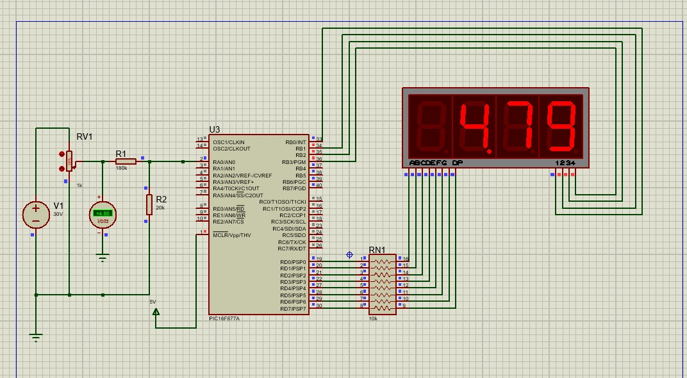

# 🔋 Digital Voltmeter using PIC16F877A

I designed a Proteus simulation for a digital voltmeter using the PIC16F877A microcontroller. The firmware was developed in MPLAB X using XC8 in embedded C language. The project includes a complete MPLAB project folder containing the source code, along with the Proteus simulation file that demonstrates real-time voltage measurement and display using a 4-digit 7-segment multiplexed display. Additionally, the generated HEX file is provided for direct simulation or programming. All project resources, including code, simulation, and documentation, are organized and shared in the associated GitHub repository for easy access and reuse.

---

## 🖼️ Circuit Diagram


---

## 🖼️ Simulation Output



---

## 🧰 Components Used

| Component               | Value/Part No           |
|------------------------|-------------------------|
| Microcontroller        | PIC16F877A              |
| 7-Segment Display      | 4-digit, Common Cathode |
| Resistor R1            | 180kΩ (Voltage Divider) |
| Resistor R2            | 20kΩ (Voltage Divider)  |
| Resistor Network       | 330Ω (for segments)     |
| Capacitor              | 100nF (Decoupling)      |
| Potentiometer          | 1kΩ (for voltage input) |
| DC Voltage Source      | 0–30V DC                |
| Crystal Oscillator     | 20 MHz (Optional)       |

---

## 📐 Voltage Divider Calculation

To measure up to 30V with a 5V ADC, a voltage divider scales down the input:

**Voltage Divider Formula**:
```
Vadc = Vin × (R2 / (R1 + R2))
```

**Values**:
- R1 = 180kΩ  
- R2 = 20kΩ

**Calculation**:
```
Vadc = Vin × (20 / (180 + 20)) = Vin × (20 / 200) = Vin × 0.1
```

So for Vin = 30V:
```
Vadc = 30 × 0.1 = 3.0V
```

This is within the safe 0–5V ADC range.

---

## 🔢 ADC to Voltage Conversion

**PIC16F877A** has a 10-bit ADC (0–1023) with reference voltage = 5V.

**ADC output:**
```
ADC = (Vadc / 5V) × 1023
```

To convert ADC back to input voltage:
```
Vadc = (ADC × 5) / 1023
Vin = Vadc × (R1 + R2) / R2 = Vadc × 10
Vin = (ADC × 5 × 10) / 1023
Vin ≈ ADC × 0.0488
```

---

## 📟 Microcontroller & Pin Mapping

| Function            | Port        | Pin Numbers           |
|---------------------|-------------|------------------------|
| ADC Input           | RA0/AN0     | Pin 2                  |
| Segment Data Lines  | PORTD (RD0–RD7) | Pins 19–22, 27–30   |
| Digit Control Lines | PORTB (RB0–RB3) | Pins 33–36         |

---

## 🧾 Code Logic Overview (main.c)

```c
#include <xc.h>
#define _XTAL_FREQ 20000000

// Segment patterns
const unsigned char seg_no_dp[]  = {0x3F,0x06,0x5B,0x4F,0x66,0x6D,0x7D,0x07,0x7F,0x6F};
const unsigned char seg_with_dp[]= {0xBF,0x86,0xDB,0xCF,0xE6,0xED,0xFD,0x87,0xFF,0xEF};

// Digit control pins
#define digit1 PORTBbits.RB0
#define digit2 PORTBbits.RB1
#define digit3 PORTBbits.RB2
#define digit4 PORTBbits.RB3

unsigned char digit_vals[4]; // Holds segment values for each digit

void Analog_setting() {
    ADCON0 = 0x81;     // ADC ON, Channel 0
    ADCON1 = 0x0E;     // AN0 as analog input, rest digital
}

unsigned int Analog_read(unsigned char channel) {
    ADCON0 &= 0xC5;
    ADCON0 |= (channel << 3);
    __delay_ms(2);        // Acquisition delay
    ADCON0bits.GO_DONE = 1;
    while (ADCON0bits.GO_DONE);
    return (ADRESH << 2) | (ADRESL >> 6);
}

void update_display_digits(unsigned int mv) {
    unsigned int d1 = mv / 1000;
    unsigned int d2 = (mv / 100) % 10;
    unsigned int d3 = (mv / 10) % 10;
    unsigned int d4 = mv % 10;

    if (d1 == 0) {
        digit_vals[0] = 0x00;            // Blank 1st digit if leading zero
        digit_vals[1] = seg_with_dp[d2]; // Decimal point on second digit
        digit_vals[2] = seg_no_dp[d3];   // Tens
        digit_vals[3] = seg_no_dp[d4];   // Units
    } else {
        digit_vals[0] = seg_no_dp[d1];     // Thousands
        digit_vals[1] = seg_with_dp[d2];   // Hundreds with decimal
        digit_vals[2] = seg_no_dp[d3];     // Tens
        digit_vals[3] = seg_no_dp[d4];     // Units
    }
}

void refresh_display() {
    PORTD = digit_vals[0];
    digit1 = 0; __delay_us(300); digit1 = 1;

    PORTD = digit_vals[1];
    digit2 = 0; __delay_us(300); digit2 = 1;

    PORTD = digit_vals[2];
    digit3 = 0; __delay_us(300); digit3 = 1;

    PORTD = digit_vals[3];
    digit4 = 0; __delay_us(300); digit4 = 1;
}

void main(void) {
    TRISD = 0x00; PORTD = 0x00;
    TRISB = 0x00; PORTB = 0x0F;
    digit1 = digit2 = digit3 = digit4 = 1;

    Analog_setting();

    unsigned int adc_val = 0;
    unsigned long mv = 0;

    while (1) {
        adc_val = Analog_read(0);
        mv = ((unsigned long)adc_val * 5000UL + 511) / 1023;
        update_display_digits(mv);

        for (int i = 0; i < 30; i++) {
            refresh_display();
        }
    }
}
```

---


## 🧪 Proteus Simulation Setup

**Steps:**
1. Place **PIC16F877A** MCU.
2. Add **4-digit 7-segment common cathode display**.
3. Connect segment lines to **PORTD**.
4. Connect digit select lines to **PORTB (RB0–RB3)**.
5. Connect **R1 = 180kΩ** and **R2 = 20kΩ** in series from Vin to GND.
6. Connect the middle of divider to **RA0/AN0**.
7. Add **crystal (20MHz)** and decoupling capacitors.
8. Power the MCU with 5V.

---

## 🛠 Tools Used

- **MPLAB X IDE** + XC8 Compiler
- **Proteus 8** (Simulation)


## 📌 Author

**Sathish S**  **Mohammed Siddik J**

---

## 📎 GitHub Repository

[👉 View Project on GitHub](https://github.com/Sathish0298/Digital_Voltmeter_Project)

---

## ✅ Final Notes

- Display shows **actual voltage** (e.g., 24.5V input → 24.5 on display).
- Code uses ADC channel 0 (RA0) and 10-bit resolution.
- Ensure all resistors and connections match exactly for accurate reading.
